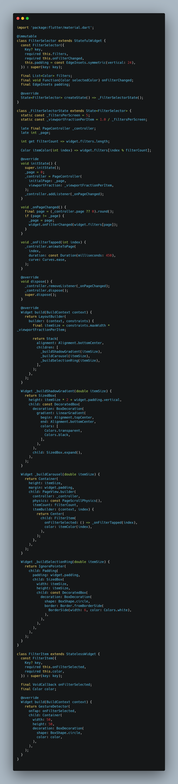
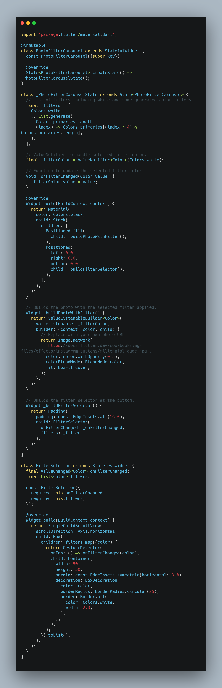
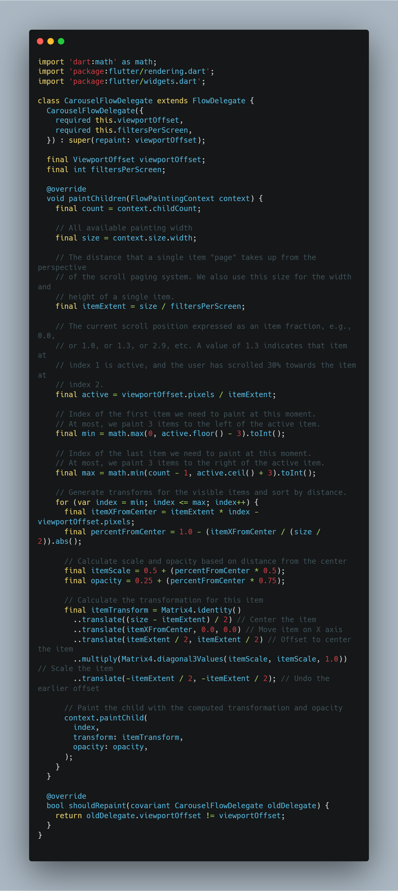
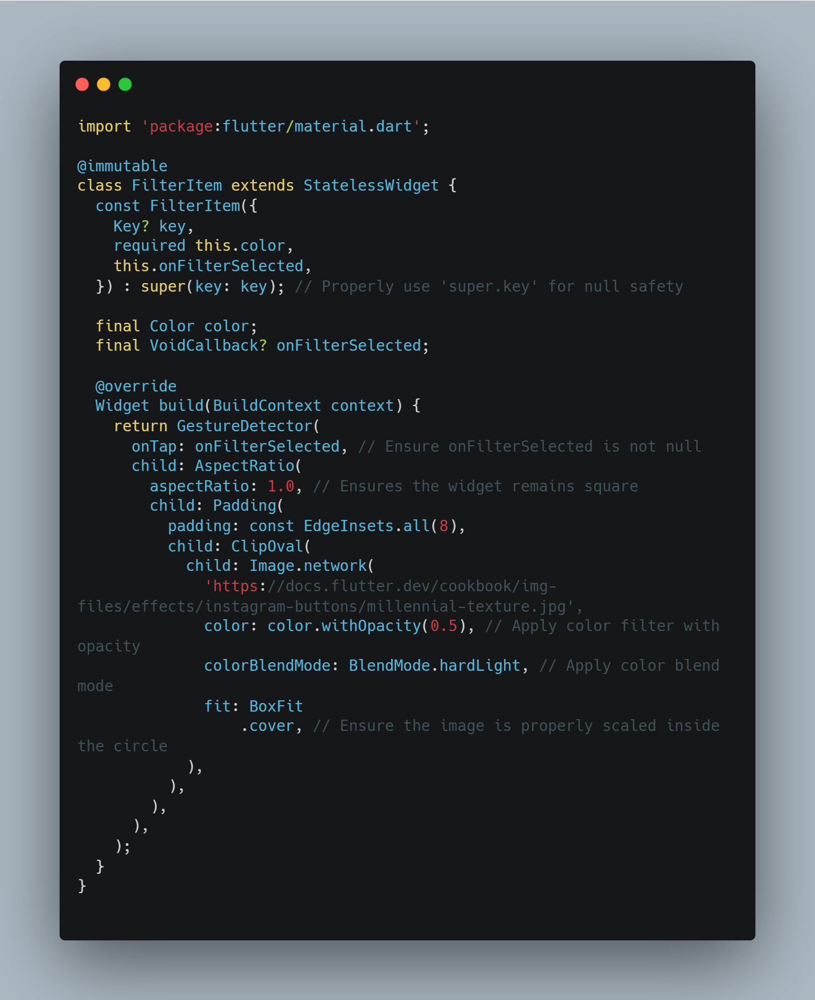
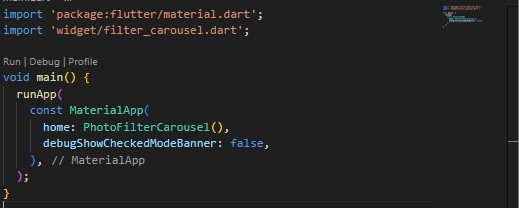

# photo_filter_carousel

A new Flutter project.

## Praktikum 2: Membuat photo filter carousel

### Langkah 1: Buat project baru

Buatlah project flutter baru di pertemuan 09 dengan nama photo_filter_carousel

### Langkah 2: Buat widget Selector ring dan dark gradient

lib/widget/filter_selector.dart

### Langkah 3: Buat widget photo filter carousel

lib/widget/filter_carousel.dart

### Langkah 4: Membuat filter warna - bagian 1

lib/widget/carousel_flowdelegate.dart

### Langkah 5: Membuat filter warna

### Langkah 6: Implementasi filter carousel

Hasil:

